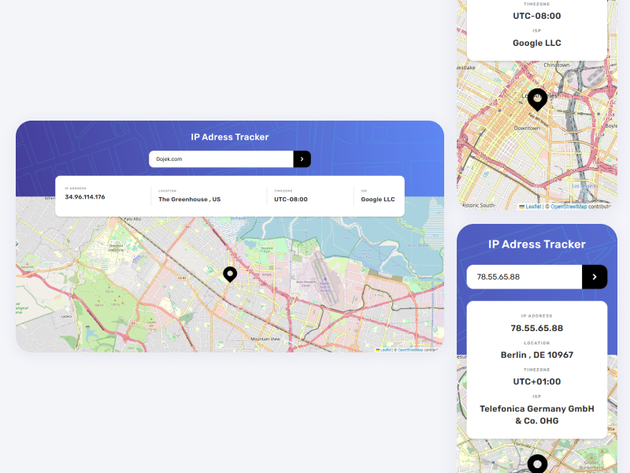

# IP address tracker solution

This is a solution to the [IP address tracker challenge on Frontend Mentor](https://www.frontendmentor.io/challenges/ip-address-tracker-I8-0yYAH0).

## Table of contents

- [IP address tracker solution](#ip-address-tracker-solution)
  - [Table of contents](#table-of-contents)
  - [Overview](#overview)
    - [The challenge](#the-challenge)
    - [Screenshot](#screenshot)
    - [Links](#links)
  - [My process](#my-process)
    - [Built with](#built-with)
  - [Author](#author)
  - [⚒ Usage](#-usage)
    - [👥 Clone the repo](#-clone-the-repo)
    - [📦 Install dependencies](#-install-dependencies)
    - [🔐 Store API KEY](#-store-api-key)
    - [✨ Start/Run the app](#-startrun-the-app)

## Overview

### The challenge

Users should be able to:

- View the optimal layout for each page depending on their device's screen size
- See hover states for all interactive elements on the page
- See their own IP address on the map on the initial page load
- Search for any IP addresses or domains and see the key information and location

### Screenshot



### Links

- Solution URL: [Github](https://github.com/metkerr/ip-address-tracker-react.git)
- Live Site URL: [Live on Vercel](https://ip-address-tracker-react-two.vercel.app/)

## My process

### Built with

- Semantic HTML5 markup
- Flexbox
- Mobile-first workflow
- [React](https://reactjs.org/) - JS library
- [Tailwind](https://tailwindcss.com/) - For styles
- [ipify API](https://www.ipify.org/) - Geolocation data API
- [leafletjs](https://leafletjs.com/) - render interactive map API

## Author

- Website - [Metker](https://metkerr.github.io/)
- Frontend Mentor - [@metkerr](https://www.frontendmentor.io/profile/metkerr)
- Twitter - [@metkerr](https://twitter.com/metkerr)

## ⚒ Usage
 ### 👥 Clone the repo

 ```shell
 $ git clone https://github.com/metkerr/rest-countries-api-with-color-theme-switcher.git
 ```

### 📦 Install dependencies
```shell
$ cd rest-countries-api-with-color-theme-switcher
$ npm install
```

### 🔐 Store API KEY
Create a .env file with GUI or with `.>.env ` command, and insert your ipify API KEY:
```js
REACT_APP_KEY=YOUR_API_KEY
```
**you can get your own api key from https://www.ipify.org/**

### ✨ Start/Run the app
```shell
$ npm start
```
